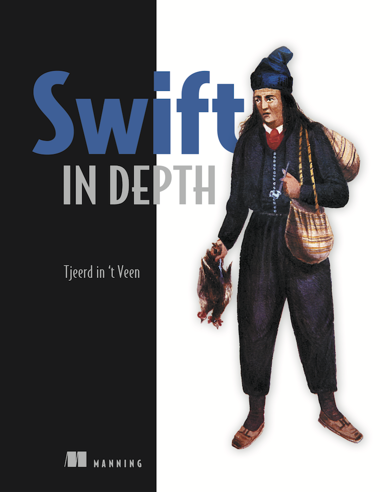

# Swift in Depth 

Here you can find the source and exercises of the book Swift in Depth, published by Manning.

[Link to the book](https://www.manning.com/books/swift-in-depth)

Each chapter has a playground which can be opened with Xcode.  You may find the source and exercises here.

You need Xcode 10 and Swift 4.2.

If you don't see the pages, press cmd+1 to open Xcode's file inspector.

For a better view in Xcode, make sure rendered markedup is enabled. You can do this by going to Editor > Show Rendered Markup.

Enjoy and good luck with the exercises!

